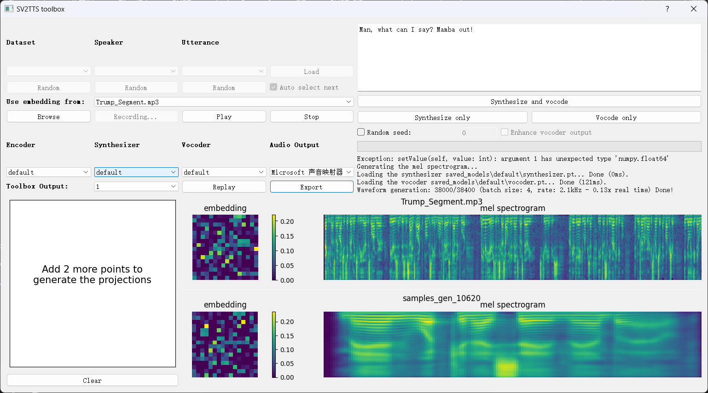

### 语音信息处理大作业demo说明

🖋️运行流程：

1. 安装好所有必要的依赖之后运行 `python main.py`
2. 在界面中点击 `Browse` 选取你要用于语音合成的音色（30 秒以内为佳）
3. 在界面中输入你要用于语音合成的字符串
4. 点击 `Synthesize and vocode` 进行语音合成，稍等片刻
5. 点击 `Export` 可进行导出，建议导出 `.mp3` 格式

---

> 以下是界面展示：
>
> 
